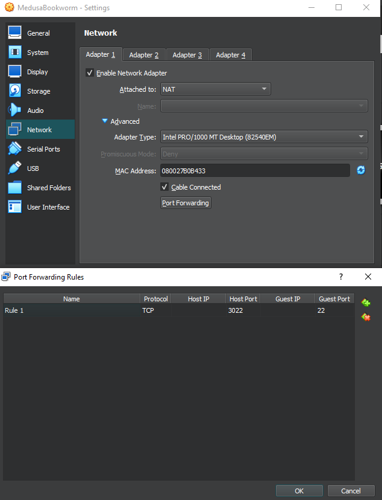

This project is used for automated testing for Medusa security Module running on remote or in Virtual Box.

# Setup

## Requirements for Host machine
1. Installed Python 3 of version 3.11.2 or higher
2. Pip package manager updated to the latest version
3. Updated setuptools package to the latest version

## Requirements for Remote machine
1. Installed Medusa security module from [this repository](https://github.com/Medusa-Team/linux-medusa)
2. Installed Constable authorization server form [this repository](https://github.com/Medusa-Team/Constable)
3. Installed and enabled SSH server
4. Installed Python 3 under alias python3

## Setup for Host machine
1. Clone repository
2. Navigate into project root folder and run setup(python alias depends on your installation):
```
py setup.py install
```
## Setup for Remote machine
1. Install pexpect python package:
```
pip install pexpect
```
2. Turn off sudo password prompt, open file:
```
sudo visudo -f /etc/sudoers
```
and set following rule for user who will be used for SSH connection:
```
your_username ALL=(ALL) NOPASSWD: ALL
```
## Using Virtual Box
In case you wish to use Virtual Box API for use case, that remote machine is running in Virtual Box
and you want automatic VM machine startup, follow these steps:
1. Download Virtual Box SDK from [here](https://www.virtualbox.org/wiki/Downloads)
2. Navigate to extracted folder into `installer` directory
3. Run following command(python alias depends on your installation):
```
py vboxapisetup.py install
```
4. In case you are running environment on Microsoft Windows, install pywin32 using following command:
```
pip install pywin32
```
5. Enable Virtual box port forwarding for VM in `settings > network > advanced > port forwarding` and add rule:



# Running environment
In this section we will explain how to configure and run environment.
## Config
1. Open INI file located on path `mte/config.ini`
2. Change values as needed.
Attributes explanation:
```
[target]
using_vb - If you wish to use Virtual Box API
name - Name of VM, required valid value if 'using_vb' is 'true'
port - SSH port for remote
ip - IP address/host name for remote SSH connection
username - username for SSH connection, must have sudo privilages
password - password for SSH conenction

[env]
medusaDir - Medusa installation dir, optional
constableDir - Constable installation dir, optional
environmentDir - Path where testing will be executed, created on start, if doesn't exist
```

## Running app
To run environment in `shell` mode use following command:
```
py run.py
```
Environment supports `degub` mode using `--debug` flag and gui mode using parameter `–-mode gui`

Example of running environment in gui mode with debug:
```
py run.py –-mode gui –-debug
```